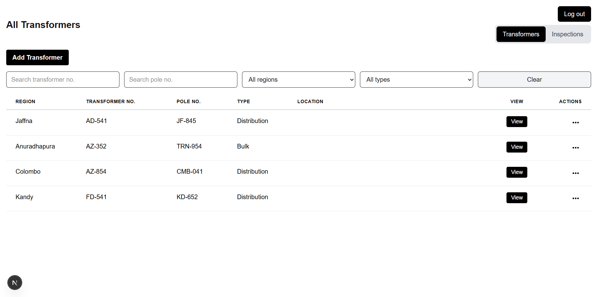
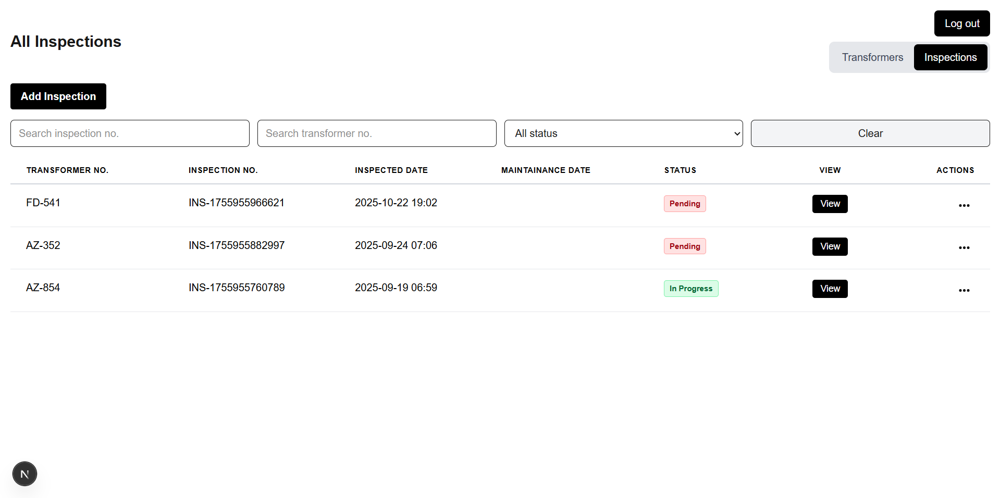
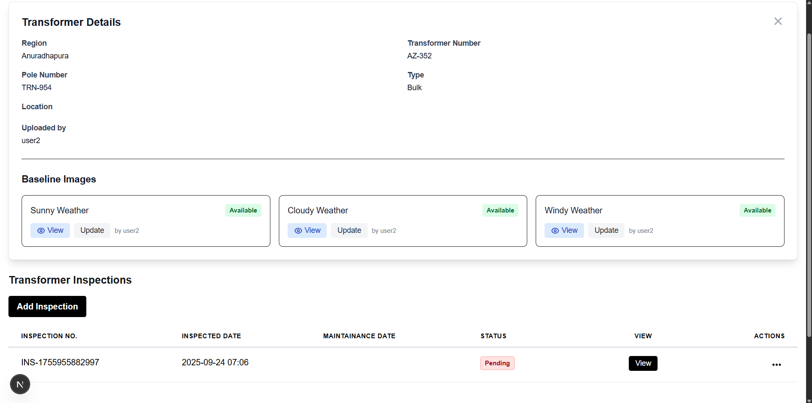

# Apex Grid

Next.js App Router app with Prisma + SQLite. Data is stored locally in `prisma/dev.db`. Images are saved as base64 strings in the database. Inspections relate to Transformers and are cascade-deleted when a Transformer is removed.

## Prerequisites

- Node.js 18+ (20+ recommended)
- pnpm (preferred)
  - If needed (one-time): `npm i -g pnpm`

## Quick start

1) Install dependencies: `pnpm install`
2) Initialize the database: `pnpm run db:setup`
3) Start the dev server: `pnpm run dev`
4) Open <http://localhost:3000>

## Database (SQLite + Prisma)

- Schema: `prisma/schema.prisma`, DB file at `prisma/dev.db` (no `.env` needed locally)
- First-time setup: `pnpm run db:setup` (runs `prisma generate` + `prisma migrate dev`)
- Useful:
  - `pnpm run prisma:studio` — open Prisma Studio
  - `pnpm run db:reset` — reset and re-apply migrations (destructive)

## Auth

- Log in with `user1`..`user5` using the same value as the password (e.g., `user3`/`user3`).
- On first successful login, the user record is auto-created in the DB via `/api/login` with a hashed password.
- The UI shows “Logged in as username” and records `uploadedBy` for created/updated entities and images.

## Features

- Transformers and Inspections CRUD (App Router API routes with Prisma)
- Image uploads stored as base64 in the DB; baseline images can be added/removed
- Favourites: toggle star in lists; filter by favourites via checkbox
- Search/filters:
  - Transformers: by transformer number, pole number; region/type dropdowns
  - Inspections: similar search inputs
- Validation:
  - Adding/Editing Inspections: transformer must exist; minimum date is today
  - Adding Transformers: client-side check to ensure `transformerNumber` is unique
- Cascade delete: deleting a Transformer removes its Inspections

## Project structure (high level)

- `app/` — App Router pages and API handlers
  - `app/api/transformers` and `app/api/inspections` — CRUD endpoints (Prisma)
  - `app/api/login` — DB-backed login
- `components/` — UI components and modals
- `lib/prisma.ts` — Prisma client singleton
- `prisma/` — Prisma schema, migrations, and the SQLite DB file
- `types/` — shared TypeScript types

## Project Description

- The project has 2 main pages: transformers and inspections.
- The transformers page allows users to create, read, update, and delete (CRUD) transformer records.

- The inspections page allows users to view and manage inspection records.

- Details pertaining to a particular transformer can be viewed in a user friendly interface.

- An AI model can be used to analyze and generate insights from the thermal images of transformers.

## Troubleshooting

- prisma generate/migrate errors: try `pnpm run db:reset` (destructive), or delete `prisma/dev.db` and re-run `pnpm run db:setup`.
- If the dev server fails on first run, stop it, run `pnpm run db:setup` once, then `pnpm run dev`.
- Windows: no extra setup is required; Prisma downloads engines automatically.

## Notes

- Package manager: pnpm-first. Running `pnpm install` in the project root installs all dependencies. No extra global tools are required beyond pnpm and Node.
- No environment variables are required for local development.
