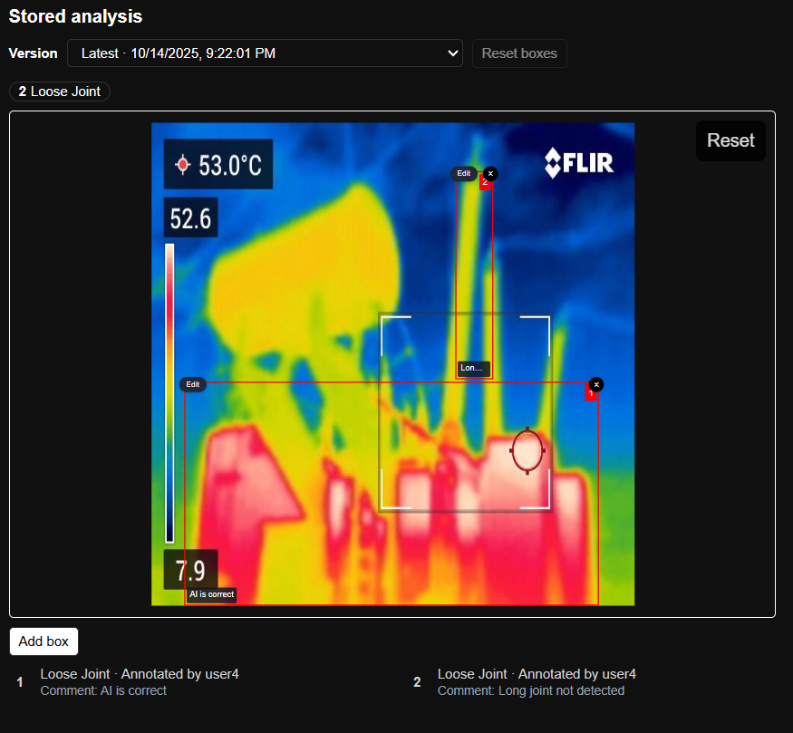

# Apex Grid

## Live app

- Production (deployed): <https://apex-grid-transformer-tracker.vercel.app/>
- Want to run everything locally? Use the instructions in `Instructions.md`.

## Auth

- Log in with `user1`..`user5` using the same value as the password (e.g., `user3`/`user3`).
- Backend handles user creation/verification on first successful login at `/api/login`.
- The UI shows “Logged in as username” and records `uploadedBy` for created/updated entities and images.

## Features

- Transformers and Inspections CRUD (App Router API routes with Prisma)
- Image uploads stored as base64 in the DB; baseline images can be added/removed
- Favourites: toggle star in lists; filter by favourites via checkbox
- Search/filters:
  - Transformers: by transformer number, pole number; region/type dropdowns
  - Inspections: similar search inputs
- Validation:
  - Adding/Editing Inspections: transformer must exist; minimum date is today
  - Adding Transformers: client-side check to ensure `transformerNumber` is unique
- Cascade delete: deleting a Transformer removes its Inspections
- Now available in dark mode!

## Project structure (high level)

- `frontend/` — Next.js frontend
  - `app/` — App Router pages
  - `components/` — UI components and modals
  - `lib/api.ts` — centralized `NEXT_PUBLIC_BACKEND_URL` base and helper
  - `lib/prisma.ts` — Prisma client singleton
  - `types/` — shared TypeScript types
- `backend/` — Spring Boot app (controllers, entities, repos, config)
  - `src/main/resources/application.yml` — DB config (H2 file-based)
  - `src/main/java/com/apexgrid/transformertracker/` — Java source
    - `controller/` — REST API controllers
    - `model/` — JPA entities
    - `repository/` — Spring Data JPA repositories
    - `service/` — business logic services

## Project Description

- The project has 2 main pages: transformers and inspections.
- The transformers page allows users to create, read, update, and delete (CRUD) transformer records.

- The inspections page allows users to view and manage inspection records.

- Details pertaining to a particular transformer can be viewed in a user friendly interface.

- Details pertaining to a particular inspection can be viewed in a user friendly interface.

- An AI model can be used to analyze and generate insights from the thermal images of transformers.

## For Improvements

- Feel free to open issues or submit PRs for any bugs, improvements, or new features.
- For your own use, you are free to customize the project as needed.
- If you find the project useful, consider starring the repo!
