# Transformer-Tracker: End-to-End System Architecture

## System Flow Diagram

```mermaid
flowchart TB
    %% User Layer
    User([👤 User/Inspector<br/>Web Browser])
    
    %% Frontend Layer
    subgraph Frontend["🎨 FRONTEND LAYER - Next.js 15 (Port 3000)"]
        direction TB
        UI[React UI Components<br/>- InspectionsList<br/>- TransformerList<br/>- ThermalImage<br/>- OverlayedThermal]
        AppRouter[Next.js App Router<br/>Server Components]
        APIRoutes[API Route Handlers<br/>/app/api/*]
        Context[React Context<br/>- InspectionsContext<br/>- TransformersContext]
        
        UI <--> Context
        Context <--> AppRouter
        AppRouter <--> APIRoutes
    end
    
    %% Communication Protocol 1
    User -->|HTTPS<br/>Browser Requests| UI
    
    %% Backend Layer
    subgraph Backend["⚙️ BACKEND LAYER - Spring Boot 3.3.3 (Port 8080)"]
        direction TB
        
        subgraph WebLayer["Web Layer (Controllers)"]
            AuthCtrl[AuthController<br/>/api/login]
            InspCtrl[InspectionController<br/>/api/inspections]
            TransCtrl[TransformerController<br/>/api/transformers]
            ProfCtrl[ProfileController<br/>/api/profile]
        end
        
        subgraph SecurityLayer["Security Layer"]
            JWTFilter[JWT Authentication Filter]
            SecConfig[Spring Security Config<br/>CORS Configuration]
            PasswordEnc[BCrypt Password Encoder]
        end
        
        subgraph ServiceLayer["Service Layer (Business Logic)"]
            InspService[Inspection Service<br/>- Image Processing<br/>- Analysis Orchestration]
            TransService[Transformer Service]
            AuthService[Authentication Service<br/>- JWT Generation]
        end
        
        subgraph DataLayer["Data Access Layer"]
            JPA[Spring Data JPA<br/>Hibernate ORM]
            Repos[Repositories<br/>- InspectionRepo<br/>- TransformerRepo<br/>- UserRepo<br/>- AIModelParamsRepo<br/>- AITuningFeedbackRepo]
        end
        
        subgraph AILayer["🤖 AI Module (Python)"]
            AnalyzeScript[analyze.py<br/>OpenCV SIFT<br/>HSV Analysis<br/>Fault Classification]
            TuneScript[tune_parameters.py<br/>Model Parameter Tuning]
            PythonRuntime[Python Runtime<br/>Dependencies:<br/>- opencv-contrib-python<br/>- numpy<br/>- Pillow]
            
            AnalyzeScript --> PythonRuntime
            TuneScript --> PythonRuntime
        end
        
        AuthCtrl --> AuthService
        InspCtrl --> InspService
        TransCtrl --> TransService
        ProfCtrl --> AuthService
        
        AuthService --> JPA
        InspService --> JPA
        TransService --> JPA
        
        InspService -->|Process Invocation<br/>Command Line| AnalyzeScript
        InspService -->|Process Invocation<br/>Command Line| TuneScript
        
        JPA --> Repos
        
        SecConfig -.->|Protects| WebLayer
        JWTFilter -.->|Validates| WebLayer
    end
    
    %% Communication Protocol 2
    APIRoutes -->|HTTP REST API<br/>JSON Payload<br/>JWT Authorization Header<br/>CORS: http://localhost:3000| AuthCtrl
    APIRoutes -->|HTTP REST API<br/>JSON Payload<br/>JWT Authorization Header| InspCtrl
    APIRoutes -->|HTTP REST API<br/>JSON Payload<br/>JWT Authorization Header| TransCtrl
    APIRoutes -->|HTTP REST API<br/>JSON Payload<br/>JWT Authorization Header| ProfCtrl
    
    %% Database Layer
    subgraph Database["💾 DATABASE LAYER - Supabase Platform"]
        direction TB
        PostgreSQL[(PostgreSQL Database<br/>Tables:<br/>- users<br/>- transformers<br/>- inspections<br/>- ai_model_parameters<br/>- ai_tuning_feedback)]
        SupabaseInfra[Supabase Infrastructure<br/>- Connection Pooling<br/>- SSL/TLS Encryption<br/>- Managed Hosting]
        
        PostgreSQL -.-> SupabaseInfra
    end
    
    %% Communication Protocol 3
    Repos <-->|JDBC Connection<br/>PostgreSQL Protocol<br/>SSL/TLS Encrypted<br/>HikariCP Pool<br/>Max Pool: 5<br/>Min Idle: 2| PostgreSQL
    
    %% Build & Deployment
    subgraph DevOps["🔧 BUILD & DEPLOYMENT"]
        direction LR
        Maven[Apache Maven 3.9+<br/>- Dependency Management<br/>- Spring Boot Plugin<br/>- Java 21 Compiler]
        NPM[Node.js/pnpm<br/>- Package Management<br/>- Next.js Build]
    end
    
    Maven -.->|mvn spring-boot:run<br/>Builds & Runs| Backend
    NPM -.->|pnpm run dev<br/>Development Server| Frontend
    
    %% Data Flow Annotations
    subgraph DataFlow["📊 KEY DATA FLOWS"]
        direction TB
        Flow1[1️⃣ Authentication Flow<br/>User credentials → JWT token generation]
        Flow2[2️⃣ Image Upload Flow<br/>Thermal image → Base64 encoding → Database storage]
        Flow3[3️⃣ AI Analysis Flow<br/>Baseline + Candidate images → Python AI → Fault detection results]
        Flow4[4️⃣ Annotation Flow<br/>Bounding boxes + Fault types → Database → UI overlay rendering]
    end
    
    style User fill:#e1f5ff,stroke:#01579b,stroke-width:3px
    style Frontend fill:#e8f5e9,stroke:#2e7d32,stroke-width:2px
    style Backend fill:#fff3e0,stroke:#e65100,stroke-width:2px
    style Database fill:#f3e5f5,stroke:#4a148c,stroke-width:2px
    style DevOps fill:#fce4ec,stroke:#880e4f,stroke-width:2px
    style AILayer fill:#e0f2f1,stroke:#004d40,stroke-width:2px
    style DataFlow fill:#fff9c4,stroke:#f57f17,stroke-width:2px
```



## Detailed Component Interactions

### 1. **Frontend Layer (Next.js 15 - Port 3000)**
- **Framework**: Next.js with App Router, React 19, TypeScript
- **UI Components**: 
  - Thermal image viewers with bounding box overlays
  - Inspection and transformer management interfaces
  - Real-time annotation editing
- **State Management**: React Context API for global state
- **Styling**: Tailwind CSS 4
- **Communication**: Fetch API for REST calls to backend

### 2. **Backend Layer (Spring Boot 3.3.3 - Port 8080)**

#### 2.1 Web Layer (REST Controllers)
- **AuthController** (`/api/login`): Handles authentication
- **InspectionController** (`/api/inspections`): Manages thermal inspections
- **TransformerController** (`/api/transformers`): Manages transformer assets
- **ProfileController** (`/api/profile`): User profile management

#### 2.2 Security Layer
- **JWT Authentication**: Token-based stateless authentication
  - Secret key configured in `application.yml`
  - Token expiry: 86400 seconds (24 hours)
- **CORS Configuration**: Allows `http://localhost:3000`
- **BCrypt**: Password hashing with Spring Security

#### 2.3 AI Integration Module
- **Language**: Python 3.x
- **Invocation**: Java `ProcessBuilder` executing `analyze.py`
- **Analysis Pipeline**:
  1. **Image Alignment**: SIFT feature detection + Homography transformation
  2. **Color Space Analysis**: RGB → HSV conversion
  3. **Thermal Detection**: Warm pixel detection (H ≤ 0.17 or H ≥ 0.95)
  4. **Region Detection**: Connected component analysis
  5. **Fault Classification**:
     - Loose Joint (coverage ≥30%)
     - Point Overload (small isolated regions)
     - Wire Overload (high aspect ratio ≥2.0)
  6. **Severity Calculation**: Delta-V brightness analysis (0.15-0.50 range)
- **Output**: JSON with bounding boxes, fault types, severity levels

#### 2.4 Data Access Layer
- **ORM**: Hibernate JPA
- **Repositories**: Spring Data JPA interfaces
- **Connection Pool**: HikariCP
  - Maximum pool size: 5
  - Minimum idle: 2
  - Connection timeout: 20s
  - Idle timeout: 30s
  - Max lifetime: 30min

### 3. **Database Layer (Supabase PostgreSQL)**
- **Platform**: Supabase (managed PostgreSQL hosting)
- **Connection**: SSL/TLS encrypted (sslmode=require)
- **Schema**:
  - `users`: User credentials and profiles
  - `transformers`: Transformer assets with baseline images (sunny/cloudy/windy)
  - `inspections`: Thermal inspection records with AI analysis results
  - `ai_model_parameters`: Tunable AI model configuration
  - `ai_tuning_feedback`: AI performance feedback for continuous improvement

### 4. **Communication Protocols**

| Layer | Protocol | Details |
|-------|----------|---------|
| **User ↔ Frontend** | HTTPS | Browser-based web requests |
| **Frontend ↔ Backend** | HTTP REST | JSON payloads, JWT in Authorization header, CORS enabled |
| **Backend ↔ Database** | PostgreSQL Protocol | JDBC over SSL/TLS, connection pooling (HikariCP) |
| **Backend ↔ AI Module** | Process IPC | Command-line invocation, JSON I/O via stdin/stdout |

### 5. **Build & Deployment**

#### Backend Build (Maven)
```powershell
mvn clean install
mvn spring-boot:run
```
- **Runtime**: Java 21
- **Environment Variables**:
  - `DB_URL`: PostgreSQL connection string (Supabase)
  - `DB_USERNAME`: Database username
  - `DB_PASSWORD`: Database password

#### Frontend Build (pnpm)
```powershell
pnpm install
pnpm run dev
```
- **Runtime**: Node.js 20+
- **Dev Server**: Turbopack-enabled Next.js dev server

### 6. **Critical Data Flows**

#### 6.1 Authentication Flow
1. User enters credentials in browser
2. Frontend sends POST to `/api/login`
3. Backend validates against `users` table (BCrypt comparison)
4. JWT token generated and returned
5. Token stored in frontend context for subsequent requests

#### 6.2 Thermal Analysis Flow
1. User uploads thermal image via frontend
2. Image encoded as Base64 Data URL
3. Backend retrieves baseline image from transformer record
4. Both images written to temporary files
5. `analyze.py` invoked via ProcessBuilder
6. Python script performs SIFT alignment, HSV analysis, fault detection
7. JSON results parsed by backend
8. Bounding boxes and fault types persisted to `inspections` table
9. Results returned to frontend
10. UI renders thermal overlay with color-coded bounding boxes

#### 6.3 Annotation Management Flow
- **Add Box**: `POST /api/inspections/{id}/boxes` → Appends to `boundingboxes` and `faulttypes` JSON arrays
- **Delete Box**: `DELETE /api/inspections/{id}/boxes/{index}` → Removes from arrays by index
- **Clear Analysis**: `POST /api/inspections/{id}/clear-analysis` → Resets all AI fields

### 7. **Technology Stack Summary**

| Component | Technology |
|-----------|------------|
| **Frontend** | Next.js 15, React 19, TypeScript, Tailwind CSS 4 |
| **Backend** | Spring Boot 3.3.3, Java 21, Spring Security, Spring Data JPA |
| **Database** | PostgreSQL (Supabase managed) |
| **AI/ML** | Python 3.x, OpenCV, NumPy, Pillow |
| **Authentication** | JWT (jjwt 0.11.5), BCrypt |
| **Build Tools** | Maven 3.9+, pnpm, npm |
| **Connection Pooling** | HikariCP |
| **ORM** | Hibernate |

---

## System Characteristics

- **Architecture**: Three-tier web application (Presentation → Business Logic → Data)
- **Communication**: RESTful API with JWT authentication
- **Data Format**: JSON for API payloads, Base64 for image encoding
- **Security**: SSL/TLS encryption, JWT tokens, password hashing, CORS protection
- **AI Processing**: Server-side Python execution with OpenCV-based thermal analysis
- **Database**: Cloud-hosted PostgreSQL with connection pooling
- **Deployment**: Separate development servers for frontend (3000) and backend (8080)
